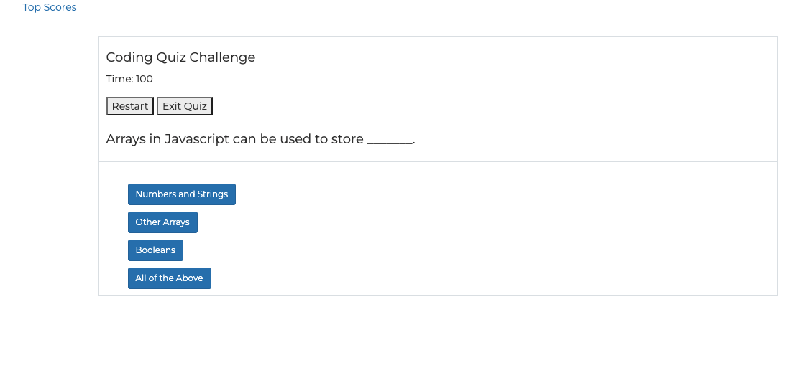

# Code-Quiz
(https://justin-morrow.github.io/Code-Quiz/)

## Table of Contents

- [Description](#Description)

- [Installation](#Installation)

- [Instructions](#Instructions)

- [License](#License)

- [Contribute](#Contribute)

- [Tests](#Tests)

- [Questions](#Questions)

## Description

According to Wikipedia "A web API is an application programming interface for either a web server or a web browser. It is a web development concept, usually limited to a web application's client-side (including any web frameworks being used), and thus usually does not include web server or browser implementation details such as SAPIs or APIs unless publicly accessible by a remote web application.

A server-side web API is a programmatic interface consisting of one or more publicly exposed endpoints to a defined request–response message system, typically expressed in JSON or XML, which is exposed via the web—most commonly by means of an HTTP-based web server."

The Code Quiz project is an assignment that asks for the web developer to create a coding quiz and add specific criteria in order to have the user scores saved to local storage. The quiz has multiple choice questions then guides the user to answer by clicking the mouse on the best choice. The user then reviews the question if right or wrong and then moves on to the next question until the end of the quiz. At the end of the quiz, the user enters their initials and submits into the top scores storage. Then, the user can exit the quiz or begin again.

## Installation

The program requires a basic opearting system such as windows or iOS needs a web browswer. It also requires the implementation of HTML, CSS, Javascript and Web API's in order to complete the project. 

## Instructions

The Code Quiz is a timed application. The quiz begins by clicking the "Let's Get Started" button and the timer begins to count down from 120 seconds. Then, the user is presented with the question and asked to click on the correct answer. If the user answers the question incorrectly, the timer will lose 10 seconds from the time remaining on the clock. After all the questions are answered, or the timer runs to 0 seconds, then the quiz is over and the user enters their name or initials and then is displayed their score to compare against the other users scores. The scores are saved in local storage. 

## License

This application is covered under the GNU GPLv3.0 License.

## Contribute

Justin Morrow

## Tests

No Tests.

## Questions

If you have questions, please contact me at the information below:

GitHub: [Justin Morrow](https://github.com/Justin-Morrow)
